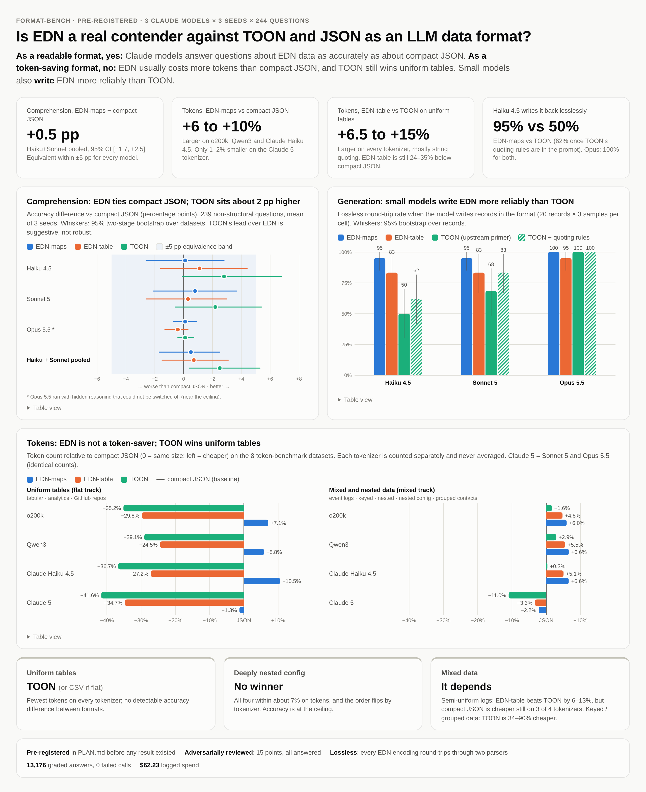

# format-bench: EDN vs TOON vs JSON as LLM data formats

Does it pay to hand an LLM your data as **EDN** (Clojure's data notation) instead of
**JSON** or **[TOON](https://github.com/toon-format/toon)**? This repo tests that on
upstream TOON's own benchmark: 244 retrieval questions over 13 datasets, 3 Claude models
(Haiku 4.5, Sonnet 5, Opus 5.5), 3 seeds, 13,176 graded answers. It also counts tokens on
four tokenizers and checks how reliably each model *writes* each format.

**Short answer:** EDN is a real contender as a *readable* format. Models answer questions
about EDN data as accurately as about compact JSON. It is **not** a token-saver: EDN usually
costs more tokens than compact JSON, and TOON still wins uniform tables. Small models also
*write* EDN much more reliably than TOON. If you are choosing a format to feed or get back
from an LLM (Clojure folks weighing EDN for tool calls, or anyone relying on TOON to cut
prompt size), this is for you.

<picture>
  <source media="(prefers-color-scheme: dark)" srcset="docs/results-dark.png">
  
</picture>

<sub>Built as an HTML results page ([`docs/results.html`](docs/results.html), open it for hover
tooltips and table views) and captured as PNG for this README.</sub>

## Headline findings

| Question | Answer | Key numbers |
|---|---|---|
| Do models understand EDN as well as JSON? | **Yes, equivalent** | EDN-maps − compact JSON: Haiku +0.1 pp, Sonnet +0.8 pp, Opus +0.1 pp. Haiku+Sonnet pooled +0.5 pp, 95% CI [−1.7, +2.5]. Inside a ±5 pp equivalence margin for every model, under every robustness check. |
| As well as TOON? | **About 2 pp lower, suggestive only** | Haiku+Sonnet, EDN-table vs TOON: −1.8 pp [−3.8, +0.1]. Not robust under dataset-level resampling or Holm correction. TOON's lead over JSON is the same size (+2.5 pp). |
| Does EDN save tokens vs compact JSON? | **No, except barely on Claude 5** | EDN-maps is 6–10% *larger* on o200k, Qwen3 and Claude Haiku 4.5, and 1–2% smaller on the Claude 5 tokenizer (Sonnet 5 / Opus 5.5). |
| Can EDN match TOON on tables? | **No** | EDN-table is 6.5–15% larger than TOON on uniform tables on every tokenizer, mostly from string quoting. It is still 24–35% smaller than compact JSON. |
| Does a ~150-token EDN primer help? | **No measurable effect** | −0.1 pp [−0.9, +0.8] vs a one-line primer. EDN was already understood without it. |
| Which format do models write back correctly? | **EDN, for small models** | Lossless round-trip, Haiku: EDN-maps 95%, EDN-table 83%, TOON 50% (62% with TOON's quoting rules in the prompt). Sonnet: 95% / 83% / 68% (83% with rules). Opus: 95–100% for all. |

## Which format for which data

| Data shape | Pick | Why |
|---|---|---|
| Uniform tables (arrays of same-shape records) | **TOON**, or CSV if the data is flat | Fewest tokens on every tokenizer; no detectable accuracy difference between formats. |
| Deeply nested config | **No winner** | All four formats within about 7% on tokens, order flips by tokenizer; accuracy at the ceiling. |
| Mixed data | **It depends** | Semi-uniform logs: EDN-table beats TOON by 6–13%, but compact JSON is cheaper still on 3 of 4 tokenizers. Keyed or grouped data TOON can fold into tables: TOON is 34–90% cheaper. |
| Output you need the model to *write* and parse back | **EDN-maps** | Haiku and Sonnet wrote EDN-maps losslessly 95% of the time vs 50–68% for TOON. TOON's quoting rules in the prompt close the gap to EDN-table for Sonnet (83% each), less so for Haiku. JSON was not part of the generation check. |

The same employee record in each format:

```
json-compact  {"employees":[{"id":1,"name":"Darla Mertz MD","email":"vida80@yahoo.com","department":"Engineering","salary":146288,"yearsExperience":24,"active":true},…
toon          employees[100]{id,name,email,department,salary,yearsExperience,active}:
                1,Darla Mertz MD,vida80@yahoo.com,Engineering,146288,24,true
edn-maps      {:employees [{:id 1 :name "Darla Mertz MD" :email "vida80@yahoo.com" :department "Engineering" :salary 146288 :yearsExperience 24 :active true} …
edn-table     {:employees {:cols [:id :name :email :department :salary :yearsExperience :active] :rows [[1 "Darla Mertz MD" "vida80@yahoo.com" "Engineering" 146288 24 true] …
```

## Why you can trust it

- **Pre-registered.** Hypotheses, metrics, decision rules and the ±5 pp equivalence margin
  were committed in [`PLAN.md`](PLAN.md) (commit `fa4f204`) before any encoder output, token
  count or model answer existed. Every change after that is logged with its reason in
  [`DEVIATIONS.md`](DEVIATIONS.md).
- **Adversarially reviewed.** A fresh reviewer given only the plan, deviations, harness diff
  and raw results raised 15 objections. Each is answered in REPORT §9. Several changed the
  conclusions, which are reported in their weaker, post-review form, and two new runs
  (a line-broken EDN layout and a TOON arm with quoting rules) were done to test them.
- **Lossless encodings, verified.** Every EDN encoding round-trips through two independent
  parsers (`edn-data` in JS, `edn_format` in Python), key order included. TOON round-trips
  through upstream's decoder.
- **Upstream harness, unmodified.** TOON's own benchmark is vendored as-is at a pinned commit;
  every change is in [`results/review/harness.diff`](results/review/harness.diff). Questions,
  ground truths and grader are upstream's.
- **Paired and hand-audited.** Every format sees identical batches per model and seed
  (asserted by `tools/check_manifest.py`). 180 graded answers were hand-checked with 0
  grader errors; the upstream grader and ground-truth bugs later found are format-neutral.
- **Real, logged runs.** 1,728 accuracy calls, 0 failed. Logged spend: $62.23 at list price.
  Raw replies are in `results/raw/`.

## Caveats

- **Claude only.** Three Claude models; other model families may know EDN better or worse.
- **Opus 5.5 ran with hidden reasoning** that could not be switched off, so it sits near the
  ceiling and adds little signal. Headline comparisons use Haiku+Sonnet pooled.
- **Calls went through headless Claude Code, not the raw API** (no API key was available), so
  every call carried a constant ~780-token environment preamble, and questions were batched
  up to 10 per call. Both are identical across formats.
- **"Equivalent" means on this benchmark's question mix.** Many questions are answered right
  (or wrong) in every format; results on the informative subset agree but have wider CIs.
- **Generation used 20 records per cell**, so its confidence intervals are wide.

## Read more

- [`REPORT.md`](REPORT.md): the full write-up. §1 summary, §3 tokens, §4 accuracy,
  §5 generation, §6 primer break-even, §7 verdict per hypothesis, §8 grader audit,
  §9 adversarial review, §11 reproduce.
- [`PLAN.md`](PLAN.md): the pre-registration.
- [`DEVIATIONS.md`](DEVIATIONS.md): every departure from the plan, with timestamps.
- [`results/`](results/): encodings, raw replies, graded answers and analysis CSVs.

## Repository layout

| Path | What's there |
|---|---|
| `vendor/toon/` | Upstream [toon-format/toon](https://github.com/toon-format/toon) at `f151a5d`, plus the EDN encoders and task scripts under `benchmarks/` |
| `tools/` | Python runner, tokenizers, statistics and report generation |
| `generation/` | Records used for the generation check |
| `results/` | Everything the runs produced |
| `docs/` | The results page and its screenshots |

To reproduce, follow REPORT §11.
